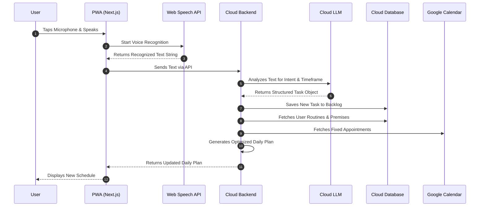

# Architecture & Technology Decisions: Make My Day

Based on the functional requirements and the decisions made, the project will be implemented using the following technology stack and architecture.

## 1. Frontend & App Delivery
**Decision:** Progressive Web App (PWA) with React/Next.js
- **Reasoning:** Allows for very fast development with modern web technologies. The app can be "installed" on the smartphone's home screen via the browser, offering an app-like experience without the massive overhead of native app development.
- **Advantages:** Cross-platform, fast deployment, seamless access.

## 2. Speech Recognition (Speech-to-Text)
**Decision:** Native Web Speech API
- **Reasoning:** No external APIs required, completely free, and directly usable via the browser. For simple dictation features in the PWA, the accuracy and speed of the system's native recognition (especially on modern iOS and Android devices) are more than sufficient.

## 3. NLP & Text Understanding
**Decision:** Cloud LLM API (e.g., Gemini, Claude, or OpenAI)
- **Reasoning:** To reliably convert free-form voice inputs like *"Install lawnmower this morning"* or *"Checkup appointment sometime tomorrow"* into structured task objects with specific time references, a Large Language Model is best suited.
- **Advantages:** Maximum flexibility for inputs; the system truly "understands" the user instead of just looking for rigid keywords.

## 4. Data Storage & Hosting
**Decision:** Cloud Hosting (Frontend e.g., Vercel, Backend/Database e.g., Supabase or Firebase)
- **Reasoning:** The app and database are securely hosted in the cloud. This makes the app accessible from any device (phone, laptop) without needing to maintain personal server hardware on a home network.
- **Storage:** User-based premises, routines, and the backlog of open tasks will be centrally stored in this cloud database.

## 5. External Integrations
**Google Calendar:**
- Utilization of the Google Calendar API (OAuth2). The app reads appointments to block these times in the daily plan and avoid them when assigning backlog tasks.

---

### Summary Application Workflow:
1. The user opens the PWA and taps the microphone button.
2. The phone's **Web Speech API** converts the spoken words directly into text.
3. The recognized text is sent to the backend and analyzed by the **LLM API**.
4. The LLM extracts the task (title) and the desired timeframe (priority), and saves the object in the **Cloud Database**.
5. The system now generates a new daily plan, taking into account:
   - Fixed **user premises** (routines, breaks) stored in the database.
   - Fetched fixed **Google Calendar appointments**.
   - Open tasks from the **backlog**.
6. The optimized daily plan is immediately updated and clearly displayed in the PWA.

### Graphical System Flow

